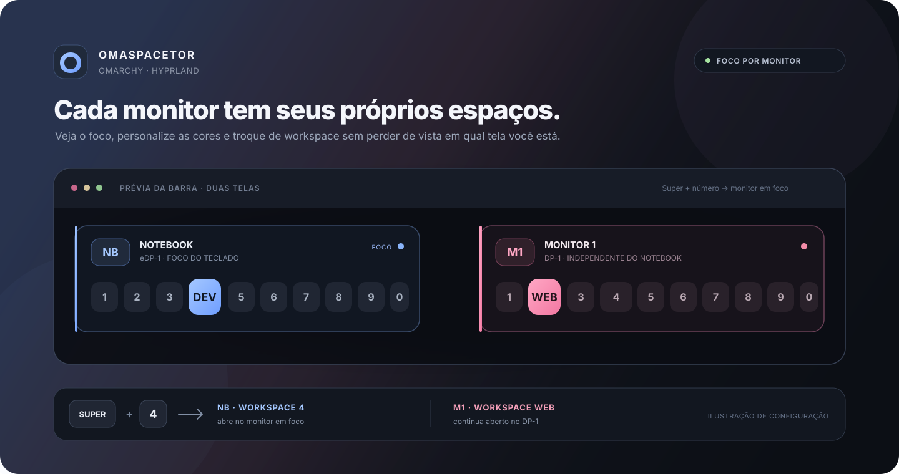

<div align="center">

# OmaSpaceTor

### Seus workspaces. Cada monitor no seu lugar.

Um seletor de workspaces para a barra do Omarchy, com foco por monitor, atalhos numéricos, rótulos curtos e cores configuráveis.



</div>

## A ideia em 10 segundos

Com a integração de teclado ativada, `Super+4` abre o workspace 4 **no monitor que está com o foco do teclado**. Se o monitor externo estiver em foco, o mesmo atalho escolhe o 4 dele. O workspace aberto na outra tela continua lá.

No Hyprland, workspaces numéricos como `1` e `2` são globais. Quando um número já pertence a outro monitor, o OmaSpaceTor cria um workspace local nomeado para manter um slot independente em cada tela. Workspaces numéricos existentes no monitor certo são reaproveitados.

> A imagem é uma simulação: `Super+4` está com o notebook em foco. O monitor externo conserva seu próprio workspace.

## O que aparece na barra

- Um grupo de slots por monitor conectado.
- Siglas automáticas: `NB` para notebook e `M1`, `M2`… para monitores externos.
- Cores diferentes por monitor; escolha uma paleta ou defina uma cor para cada saída.
- O monitor com foco do teclado e o workspace ativo de cada tela ficam destacados.
- Slots vazios são criados no monitor certo quando selecionados.
- Rótulos opcionais como `DEV`, `WEB` e `CHAT`; os atalhos continuam numéricos.
- Tooltips com o tipo de tela, nome da saída e quantidade de janelas.
- Layout horizontal ou vertical, seguindo a orientação da barra.

Clique na sigla para focar o monitor. Clique em um slot para abrir aquele workspace nele. O slot 10 aparece como `0`, acompanhando o padrão `Super+0`.

## Simulação do atalho

Imagine o notebook em `eDP-1` e uma tela externa em `DP-1`:

| Foco do teclado | Atalho | Resultado | A outra tela |
| --- | --- | --- | --- |
| Notebook (`eDP-1`) | `Super+4` | Abre o slot 4 no notebook | Continua no workspace atual |
| Monitor (`DP-1`) | `Super+4` | Abre o slot 4 no monitor externo | Continua no workspace atual |

Se o workspace numérico `4` já estiver nesse monitor, ele é usado. Se estiver em outra tela, o OmaSpaceTor cria um workspace local para aquele monitor e mantém o `4` original intacto.

## Instalação

Depois de enviar este repositório ao GitHub:

```sh
omarchy plugin add https://github.com/kauanmassuia14/omaspacetor.git --enable
omarchy plugin disable omarchy.workspaces
```

O widget entra na seção `left` por padrão. Desativar `omarchy.workspaces` evita mostrar dois seletores numéricos na barra.

Para conferir ou mudar a posição depois:

```sh
omarchy plugin list
omarchy plugin enable kauanmassuia14.omaspacetor left
```

## Ativar `Super+1` até `Super+0`

O widget funciona por clique sem tocar nos atalhos atuais. A integração abaixo é opcional; ela substitui `Super+1` até `Super+0` para escolher o slot no monitor em foco:

1. Abra `~/.config/hypr/bindings.lua`.
2. Adicione esta linha depois dos binds padrão do Omarchy:

   ```lua
   dofile((os.getenv("HOME") or "") .. "/.config/omarchy/plugins/kauanmassuia14.omaspacetor/hyprland-bindings.lua")
   ```

3. Recarregue a configuração do Hyprland:

   ```sh
   hyprctl reload
   ```

`Super+Shift+1` até `Super+Shift+0` continuam com os binds padrão para mover janelas. Se o OmaSpaceTor estiver configurado com menos slots, os atalhos acima desse limite não abrem slots escondidos.

Para desfazer a integração, remova a linha `dofile` e rode `hyprctl reload` novamente.

## Personalização

As opções ficam no objeto do OmaSpaceTor em `bar.layout.left`, `bar.layout.center` ou `bar.layout.right`, dentro de `~/.config/omarchy/shell.json`. Edite os campos desse objeto e preserve os outros widgets da sua configuração.

```json
{
  "id": "kauanmassuia14.omaspacetor",
  "workspaceCount": 10,
  "monitorLabelStyle": "short",
  "monitorLabels": {
    "eDP-1": "NB",
    "DP-1": "EXT"
  },
  "monitorColorTheme": "Pastel",
  "monitorColors": {
    "eDP-1": "#89B4FA",
    "DP-1": "#F38BA8"
  },
  "workspaceLabels": {
    "1": "CODE",
    "2": "WEB",
    "4": "DEV"
  }
}
```

| Opção | Valores | O que muda |
| --- | --- | --- |
| `workspaceCount` | `1` a `10` | Quantos slots aparecem e até qual atalho numérico funciona com a integração. |
| `monitorLabelStyle` | `short`, `full`, `output` | Sigla automática (`NB`, `M1`), nome (`Notebook`, `Monitor 1`) ou nome da saída (`DP-1`). |
| `monitorLabels` | Saída → rótulo | Substitui o rótulo automático para uma saída específica. |
| `monitorColorTheme` | `Pastel`, `Neon`, `Warm`, `Nord`, `Monochrome` | Escolhe a paleta automática distribuída entre monitores. |
| `monitorColors` | Saída → `#RRGGBB` | Define uma cor exata para cada monitor; tem prioridade sobre a paleta. |
| `workspaceLabels` | Slot → rótulo | Mostra nomes como `CODE` no lugar do número; o atalho continua sendo `Super+1`. |

Os nomes das saídas vêm de `hyprctl monitors`. Os campos de rótulos e cores aceitam objetos JSON, como no exemplo. Valores ausentes ou inválidos usam o rótulo e a cor automáticos.

## Teste rápido

Se estiver testando este checkout local, copie-o para a pasta monitorada pelo Omarchy:

```sh
rsync -a --delete --exclude=.git ./ ~/.config/omarchy/plugins/kauanmassuia14.omaspacetor/
```

1. Confira o manifesto: `omarchy plugin validate ~/.config/omarchy/plugins/kauanmassuia14.omaspacetor`.
2. Conecte duas telas e rode `hyprctl monitors` para descobrir os nomes, por exemplo `eDP-1` e `DP-1`.
3. Confirme que os dois grupos aparecem na barra, com `NB` e `M1`.
4. Clique em `M1` e use `Super+4`: o workspace 4 deve abrir no monitor externo.
5. Volte ao notebook e use `Super+4`: o 4 do notebook fica ativo sem trocar o workspace atual do monitor externo.
6. Altere `monitorColors` e `workspaceLabels` no `shell.json` para conferir suas cores e nomes.

Se você editar o código deste repositório em vez da cópia instalada, sincronize os arquivos do plugin para `~/.config/omarchy/plugins/kauanmassuia14.omaspacetor/`. Alterações salvas na pasta instalada recarregam automaticamente.

## Remover

```sh
omarchy plugin remove kauanmassuia14.omaspacetor
omarchy plugin enable omarchy.workspaces
```

Se ativou os atalhos numéricos, retire também a linha `dofile` de `~/.config/hypr/bindings.lua` e recarregue o Hyprland.

## Como os slots independentes funcionam

O OmaSpaceTor procura primeiro um workspace numérico que já pertença ao monitor escolhido. Se não houver, usa um workspace local com nome próprio, associado à saída e ao slot — por exemplo, `omaspacetor:eDP-1:4`. Assim, o notebook e a tela externa podem ter um slot 4 cada um sem mover o workspace 4 antigo.
